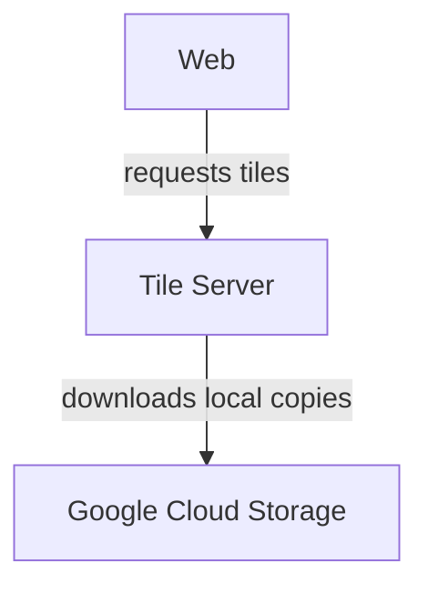

# Slippy maps

## Contributing

- `make` to download all required data
- `brew install tippecanoe`

## Notes

- Pull data from OSM (or elsewhere)
- Render that data into vector tiles using a schema (Shortbread). The schema just tells the tile renderer what data to include and what to name it, it doesn't have styling information
- Tilemaker for OSM base data, tippecanoe for story data
- Drop that data intoa tileserver
- Load the tiles with a frontend component, apply a JSON stylesheet
- Fonts need a whole separate processing step
- Martin seems to be the sensible tileserver

## References

- https://versatiles.org/
- Useful OSM dumps: https://download.geofabrik.de/europe/germany.html
- https://www.muckrock.com/news/archives/2024/feb/13/release-notes-how-to-make-self-hosted-maps-that-work-everywhere-cost-next-to-nothing-and-might-even-work-in-airplane-mode/
- https://github.com/maplibre/font-maker
