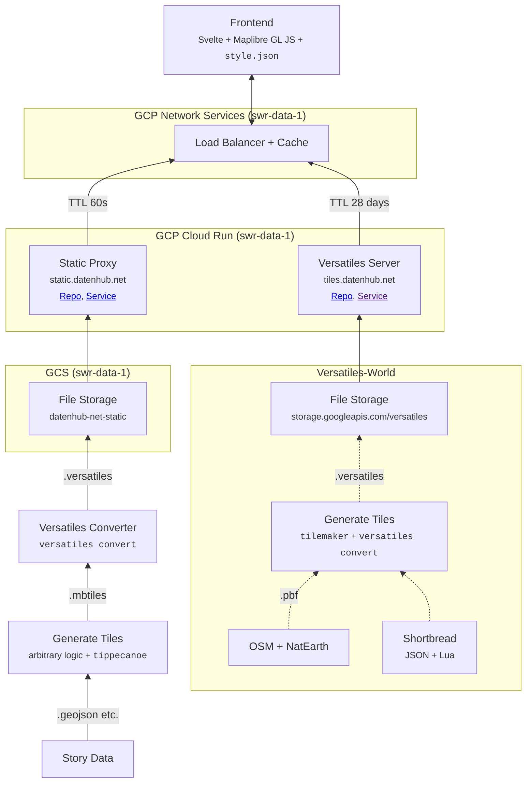

# SWR Data Slippy Map Situation

Wir haben zwei separate Wege, Kartenmaterial zu veröffentlichen:

## Versatiles

## Static Proxy

Wir haben einen Proxy-Service, der alle Requests nach static.datenhub.net bekommt. Das ist ein Node-Service aus dem Versatiles Projekt ([@versatiles/google-cloud](https://github.com/versatiles-org/node-versatiles-google-cloud)).

Die meisten Requests werden einfach durchgereicht aber es gibt einen [Special Case](https://github.com/versatiles-org/node-versatiles-google-cloud/blob/3b276f80f325c5921c339ee967a1edb575491edb/src/lib/server.ts#L94-L99) für Requests nach `*.versatiles`-Dateien. Wenn so einer kommt werden die GET-Parameter und die Container-Datei geparst, und mit dieser Info die richtige Kachel ausgeliefert. Deshalb funktionieren Requests wie: [https://static.datenhub.net/data/zensus-test/zensus2011e.versatiles?tiles/7/67/42](https://static.datenhub.net/data/zensus-test/zensus2011e.versatiles?tiles/7/67/42)[^1].

- Die ganze Architektur basiert auf öffentlichen Cloud-Run Diensten, die in `swr-data-prod` nicht unterstützt werden.
- Unser `style.json` linkt auf tiles.datenhub.net, alle anderen Daten werden als Zusatz-Layer im Frontend anghelet und mit direkten Attributen gestyled

- Wir haben zwei Google-Cloud Projekte: `swr-data-1` und `swr-data-prod`. Static Proxy, Kartenmaterial und Tileserver leben alle in `swr-data-1`, und wir können sie nicht migrieren,, weil Services in `swr-data-prod` nicht mit dem Internet reden können.

- [Versatiles Cloud Server](https://github.com/SWRdata/versatiles-cloud-server)

## References

- https://github.com/SWRdata/zensus-gitter-test

## Deprecated

- [datenhub-tiles-server](https://github.com/SWRdata/datenhub-tiles-server)
- [datenhub-static-server](https://github.com/SWRdata/datenhub-tiles-proxy) Prxy

[^1]: Das pmtiles-Format hat ein ähnliches Feature, das mit HTTP-Range-Requests funktioniert und keinen speziellen Server braucht. Das VersaTiles Projekt setzt [auf eine Tileserver-Architektur](https://github.com/versatiles-org/versatiles-rs/issues/24#issuecomment-1517567677)
